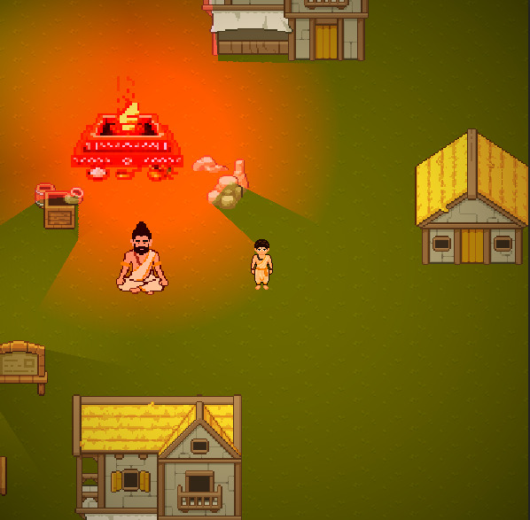
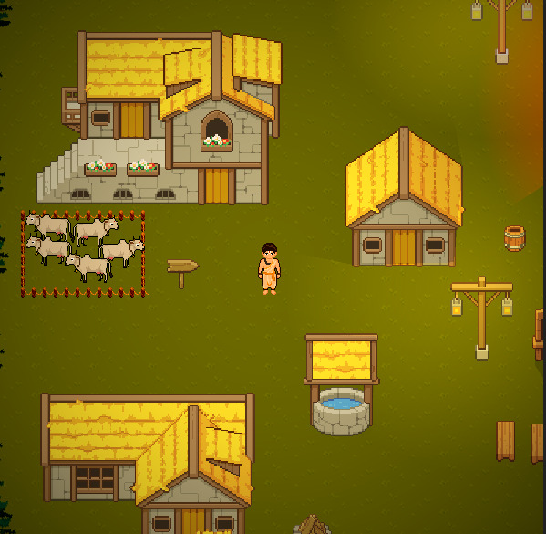
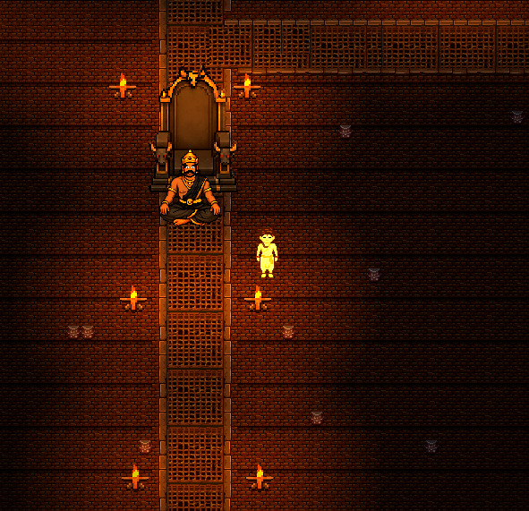
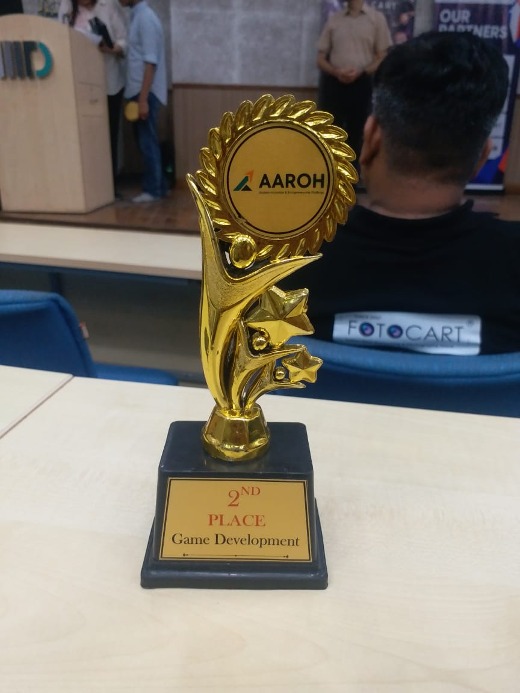
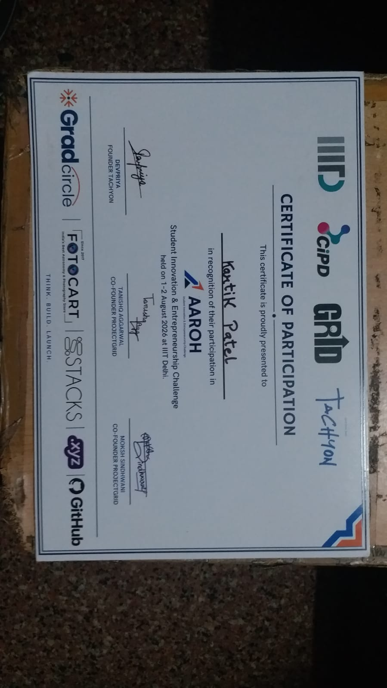

# कथा KATHA — तत् त्वम् असि (You Are That)

An AI-powered 2D adventure game based on the **Katha Upanishad (कठोपनिषद्, कृष्ण यजुर्वेद)**. Play as the young seeker **Nachiketa (नचिकेता)**, question the hypocrisy of your father **Vajashravasa (वाजश्रवस)**, journey to the realm of Death, and earn three boons from **Yama** himself.

Built in **24 hours** for the **AAROH Hackathon** (https://www.aarohindia.com/) — **2nd Place in the Game Development category** (Trophy & Certificate in [`Aaroah/`](Aaroah/)).

## Screenshots

| | | |
| --- | --- | --- |
|  |  |  |

---

## Why (कस्मात्)?

Young audiences have limited interest in Indian history and culture. KATHA exists to awaken curiosity and drive meaningful connection — turning data and ideas into immersive AI stories.

## Our Thought (अस्माकं विचार:)

We are here to awaken curiosity and drive meaningful connection, turning data and ideas into immersive AI stories.

## The Story

> The sage Vajashravasa vows to give away all his possessions in a ritual — but gives away only his old, weak, blind and barren cows. His inquisitive son Nachiketa notices the hypocrisy and asks, *"To whom will you give me?"* Enraged, his father answers, **"मृत्यवे त्वा ददामि — To Death I give you."**
>
> Taking his father's words literally, Nachiketa travels to the realm of Death and waits at Yama's doorstep for three days. Impressed, Yama grants him three boons:
>
> 1. **First Boon** — his father's anger is appeased.
> 2. **Second Boon** — he is taught the Nachiketa Fire sacrifice to heaven.
> 3. **Third Boon** — his ultimate question: *"What happens to the human soul after death?"*
>
> Yama tempts him with wealth, kingdoms and long life, but Nachiketa rejects the path of the Pleasant (**Preya / प्रेयस्**) and chooses the path of the Good (**Shreya / श्रेयस्**). Yama teaches him through the chariot allegory: the body is the chariot, the intellect the charioteer, the mind the reins, the senses the wild horses, and the Soul the master. The true Self is unborn, eternal and deathless — and the seeker who masters it attains **Brahman (ब्रह्मन्)**, the infinite supreme consciousness.

## Features

- **AI NPC dialogue system** — NPCs (Vajashravasa, Yama) are powered by a live cloud LLM via the **Groq API**, streaming JSON responses directly into in-game conversations. Dialogue adapts to the player, and every choice presented is AI-reworded to fit the character's voice — including fully improvised follow-up questions.
- **Stage-based storytelling** — each NPC has a scripted story graph (sacrifice → curse → boons → temptation → teaching) that the AI improvises inside, so the narrative can never break.
- **3 endings** based on Nachiketa's choices:
  - **SATYA** — the path of ultimate truth and renunciation
  - **TYAKTA** — returning to the world to perform duties with wisdom
  - **LOBHA** — accepting the temptations of wealth, power and long life
- **Typewriter dialogue UI** with skip, the "determination" font, and dynamic AI-generated choices.
- **3 ending art scenes**, hand-pixeled environments (candles, torches, spikes, throne, banyan tree), ambient fire SFX.

## How We Did It (कथं वयम् अकुर्म)?

| Aspect | Source |
| --- | --- |
| Game Engine | Godot 4 |
| Sprites | Hand edited / itch.io / AI |
| SFX & sounds | Pixabay / AI |
| AI NPC brain | Groq API — `llama-3.3-70b-versatile` |

## How To Run

1. Install [Godot 4](https://godotengine.org/) (project targets Godot 4.x).
2. Clone the repo and open `project.godot`.
3. `Scripts/AIManager.gd` holds the Groq API key (`gsk_...`) used for the AI dialogue. **Note:** it is currently committed to this repo — treat it as public and regenerate the key at console.groq.com if needed.
4. Press Play. Walk up to an NPC and press the interact key (Space / Enter / E) to talk.

## Project Structure

```
KATHA/
├── Assets/
│   ├── Audio/                  fire, cow, village & yama ambience
│   ├── Fonts/                  determination font + Garamond variants
│   ├── FreeEnvironment/        free itch.io environment pack (buildings, props, trees...)
│   ├── Generated/              generated light textures
│   ├── Source/                 PSD/aseprite source files
│   ├── Sprites/
│   │   ├── Characters/         Yama, Nachiketa sheets, idol & run animations
│   │   ├── Environment/        candles, torches, spikes, throne, banyan, light
│   │   └── Endings/            the three ending artworks
│   └── public-license.txt
├── Scripts/                    GDScript: AIManager, DialogueManager, NPCs, Player...
├── Scenes/                     world, player, NPC and ending scenes
├── Aaroah/                     hackathon materials: pitch deck, trophy, certificate, screenshots
└── project.godot
```

## AAROH Hackathon

- **Event:** AAROH (https://www.aarohindia.com/) — 24-hour hackathon with 4 competition domains (AI/ML, Cybersecurity, Game Development, Hardware & Simulations).
- **Category:** Game Development, covering **Track 3** (AI-powered adaptive NPCs & dynamic storytelling) and **Track 4** (young audiences' limited interest in Indian history and culture).
- **Result:** 2nd Place, Game Development.

| Trophy | Certificate |
| --- | --- |
|  |  |

- **Team सदस्य:**
  - **Kartik** (Leader) — Developer
  - **Yuvaraj** — Artist
  - **Shivam** — Play Tester
- **Certificates note:** The certificate currently uploaded is the **participation certificate**; the appreciation certificate was yet to be printed due to event mismanagement and will be updated here soon.

## License

Assets belong to their respective owners (public/free licenses where applicable, e.g. `assets/public-license.txt`).
